# datagen — Dummy Data & Auto-Rebind for Tableau Workbooks

**Goal:** Take a workbook that ships with **only a `.twb` file** (no source CSV/extract),
reconstruct a realistic dummy dataset for it, and **re-point the workbook at that data**
so that when you double-click the `.twb` it **opens straight onto live data — no "locate
the data source" prompt, no broken extract, no manual reconnect.**

This is a **hybrid** feature, matching the repo's core pattern:

> Deterministic Python does all the structural work. The AI is only (optionally)
> used to invent realistic *values*. The pipeline always produces a valid result
> even with **zero AI calls**.

---

## 1. The problem this solves

A lot of Tableau workbooks are shared without their data:

- The `.twb` references `netflix_titles.csv` or a `.hyper` extract that isn't in the folder.
- Open it → Tableau shows **"Could not connect to data source"** and every sheet is blank.
- You can't review, migrate, or QA the report because there's nothing to render.

`datagen` rebuilds a **schema-accurate, type-aware dummy dataset** from the workbook's own
metadata and rebinds the workbook to it, so the report becomes openable and reviewable on
any machine.

---

## 2. End-to-end pipeline

```mermaid
flowchart LR
    A[".twb file<br/>(only input)"] --> B["1. extract.py<br/><b>deterministic</b>"]
    B --> C["extracted.json<br/>tables, columns, types, domains"]
    C --> D["2. schema.py<br/><b>deterministic</b>"]
    D --> E["schema.json<br/>canonical types + semantics"]
    E --> F["3a. dummy_data.py plan<br/><b>deterministic</b>"]
    F --> G["dummy-todo.json<br/>AI task envelope"]
    G -. optional .-> H["3b. AI agent<br/><b>agentic</b>"]
    H -. one file .-> I["dummy-fragment.json<br/>realistic value pools"]
    E --> J["3c. dummy_data.py build<br/><b>deterministic</b>"]
    I -. merged if present .-> J
    J --> K["data/*.csv<br/>(also copied beside the .twb)"]
    K --> L["4. rebind.py<br/><b>deterministic</b>"]
    A --> L
    L --> M[".twb rebound +<br/>date params reset"]
    M --> N["Open workbook → data auto-loads"]
```



| # | Stage | File | Kind | Input → Output |
|---|-------|------|------|----------------|
| 1 | Extraction | [extract.py](extract.py) | **deterministic** | `.twb` → `extracted.json` |
| 2 | Schema | [schema.py](schema.py) | **deterministic** | `extracted.json` → `schema.json` |
| 3a | Plan | [dummy_data.py](dummy_data.py) | **deterministic** | `schema.json` → `dummy-todo.json` |
| 3b | Values (optional) | AI agent | **agentic** | `dummy-todo.json` → `dummy-fragment.json` |
| 3c | Build | [dummy_data.py](dummy_data.py) | **deterministic** | `schema.json` (+ fragment) → `*.csv` |
| 4 | Rebind | [rebind.py](rebind.py) | **deterministic** | `.twb` + CSVs → rebound `.twb` |

The single orchestrator [run_all.py](run_all.py) runs **1 → 2 → 3a → 3c → 4** in one call.

---

## 3. Stage-by-stage detail

### Stage 1 — Extraction (deterministic)

Parses the `.twb` (which is XML) and pulls out the **structure only** — it never invents
data. For each datasource it records:

- Physical tables and the CSV/extract file each maps to.
- Every column: name, Tableau datatype, role (dimension/measure), aggregation.
- Value **domains/aliases** already present in the workbook (e.g. a filter that lists
  `Movie`, `TV Show`) — these become free, real value pools.
- Delimiter / header-row info for each physical CSV.

> **Important:** Multi-CSV *federated* datasources (one connection joining several CSVs)
> are resolved **per relation** — each relation is mapped to its **own** file and the
> richest column set per physical CSV is kept. (This fixes the earlier bug where all
> joined tables collapsed onto one filename and columns overwrote each other.)

Output: `extracted.json`.

### Stage 2 — Schema (deterministic)

Turns the raw extraction into a **generator-ready schema**:

- Maps Tableau datatypes → canonical types (`string`, `integer`, `real`, `date`,
  `datetime`, `boolean`).
- Infers a **semantic** per column from its name (e.g. `*_date|created|updated` → `date`,
  `email`, `name`, `id`, `price/amount` → currency, etc.). Semantics drive realistic
  generation.
- Carries forward known domains from Stage 1.
- Sets the default row count (`--rows`, default 100).

Output: `schema.json`.

### Stage 3 — Dummy data (deterministic build, optional agentic values)

**3a. plan (deterministic):** emits `dummy-todo.json`, a compact task envelope that lists
exactly which columns would benefit from human-like values (categories, names, ratings…)
and asks for a value pool or a numeric/date range.

**3b. values (agentic, OPTIONAL):** an AI agent writes **one** file, `dummy-fragment.json`:

```json
{
  "netflix_titles.csv": {
    "type":         { "values": ["Movie", "TV Show"] },
    "rating":       { "values": ["TV-MA", "PG-13", "R", "TV-14"] },
    "release_year": { "min": 1990, "max": 2024 }
  }
}
```

**3c. build (deterministic):** merges the fragment (if any) with the schema and writes
**seeded, type-aware CSVs**. If there is **no fragment**, built-in fallback generators
still produce a valid dataset — *the AI only improves realism; it is never required.*

> The seed (`--seed`, default 42) makes the build fully reproducible: same schema +
> same fragment always yields byte-identical CSVs.

**Where the CSVs are written (two copies, by design):**

1. `Output/datagen/<Model>/data/<file>.csv` — the canonical pipeline artifact.
2. **Beside the `.twb`** (e.g. `Data/Netflix/<file>.csv`) — so the rebound workbook
   resolves its data with a **relative path** and opens on any machine.

### Stage 4 — Rebind (deterministic) — *the "auto-load, no prompt" magic*

This is what makes the workbook open without asking for a connection. `rebind.py`:

1. **Rewrites every file connection** in the `.twb` to point at the generated CSV that
   sits **right next to the workbook** (relative filename, not an absolute path). So
   Tableau finds the data immediately on open — **no "locate data source" dialog.**
2. **Resets date-range parameters** to the generated data's actual `[min, max]` window.
   Many dashboards filter `[date] >= [Start param] AND [date] <= [End param]`; if those
   params were saved outside the dummy window, **every row is filtered out → blank
   visuals**. Rebind fixes this in two places so the stale window can't leak back:
   - the parameter's `value=` attribute (the control's current value), **and**
   - the parameter's inner `<calculation formula='#…#'/>` (used by titles, calc fields
     and filters).
3. Writes the result either **in place** (default; a one-time `.twb.bak` backup is kept)
   or as a **sibling `(dummy).twb`** copy (`--rebind-copy`).

Edits are done with **targeted regex on the raw XML text**, preserving Tableau's exact
formatting, comments and XML declaration — only the touched attributes change.

> **Why no connection prompt appears:** the connection now points at a file that
> physically exists next to the `.twb`, with a matching schema. Tableau resolves it
> silently and renders the sheets.

---

## 4. How to run

### One command (recommended)

```powershell
python scripts/datagen/run_all.py "Data/Netflix"
```

This runs extract → schema → plan → build → rebind and leaves the workbook ready to open.

Useful flags:

| Flag | Effect |
|------|--------|
| `--rows 300` | Generate 300 rows per table (default 100). |
| `--seed 7` | Change the deterministic seed. |
| `--plan-only` | Stop after `plan` (emit `dummy-todo.json`, don't build/rebind). |
| `--no-rebind` | Build the CSVs but **don't** touch the `.twb`. |
| `--rebind-copy` | Write a sibling `(dummy).twb` instead of editing in place. |

### Manual stage-by-stage (if you want the AI value step)

```powershell
python scripts/datagen/extract.py "Data/Netflix"
python scripts/datagen/schema.py  "Output/datagen/NetfixWorkbook" --rows 150
python scripts/datagen/dummy_data.py plan  "Output/datagen/NetfixWorkbook"
#   → agent writes Output/datagen/NetfixWorkbook/dummy-fragment.json
python scripts/datagen/dummy_data.py build "Output/datagen/NetfixWorkbook" --rebind
```

### From code

```python
import run_all
summary = run_all.run("Data/Netflix")   # returns a dict of all artifacts
```

---

## 5. Outputs (under `Output/datagen/<PascalName>/`)

| File | Author | Purpose |
|------|--------|---------|
| `extracted.json` | code | raw structural extraction |
| `schema.json` | code | generator-ready schema |
| `dummy-todo.json` | code | AI task envelope |
| `dummy-fragment.json` | **AI** (optional) | realistic value pools — the only AI artifact |
| `data/<file>.csv` | code | generated dummy dataset (also copied beside the `.twb`) |
| `<file>.csv` beside the `.twb` | code | the copy the workbook actually binds to |
| `<workbook>.twb` (rebound) | code | connections repointed + date params reset |
| `<workbook>.twb.bak` | code | one-time backup of the original (in-place mode) |

---

## 6. Time & credit cost

The pipeline is built so the **default path costs zero AI credits** and finishes in
seconds. The AI step is optional and only enriches values.

| Stage | Kind | Typical time | AI credits |
|-------|------|--------------|------------|
| 1. Extraction | deterministic | < 1 s | 0 |
| 2. Schema | deterministic | < 1 s | 0 |
| 3a. Plan | deterministic | < 1 s | 0 |
| 3b. Values (optional) | **agentic** | ~5–20 s (one model turn) | **1 small model call** |
| 3c. Build (100–300 rows) | deterministic | < 1 s | 0 |
| 4. Rebind | deterministic | < 1 s | 0 |

### Two ways to run

- **Fully deterministic (default `run_all.py`)** — no agent call at all; the built-in
  seeded generator produces the data.
  - **Time:** ~**2–5 seconds** total for a typical workbook.
  - **Credits:** **0.**

- **With AI value enrichment (optional `plan` → agent → `build`)** — adds exactly **one**
  agent turn that writes a single small JSON (`dummy-fragment.json`).
  - **Time:** ~**15–30 seconds** total (the model turn dominates).
  - **Credits:** **one** small/cheap model call. The prompt is a compact `dummy-todo.json`
    and the output is a small value-pool JSON, so it is a low-token, low-cost request —
    on the order of a single inexpensive completion, not a multi-step agent loop.

> **Bottom line:** the whole "extract → schema → generate → rebind → auto-open" workflow
> is **seconds and ~zero credits** by default. Spend one cheap model call only when you
> want the category/name/rating values to look more realistic than the deterministic
> fallback.

---

## 7. Design rules (why it's safe & reproducible)

- Stages 1, 2 and 4 **never invent data** — they only read/rewrite structure. Fully
  reproducible.
- Stage 3 build is **seeded**, so identical inputs always yield identical CSVs.
- The AI authors **exactly one** file (`dummy-fragment.json`) and is **never required** —
  there is always a deterministic fallback.
- Rebind edits the `.twb` via **targeted regex**, preserving the original XML byte-for-byte
  except the attributes it intentionally changes, and keeps a `.twb.bak` backup in place.

---

## 8. Known limitations

- **Joined sheets** may populate only partially: join keys are randomly generated, so two
  tables joined on a key won't always match. Visuals that depend on a join can show fewer
  rows. (Single-table sheets are unaffected.)
- The workbook must be **closed in Tableau** before rebind, and **reopened after** — an
  already-open Tableau session holds the old state in memory and, if saved, would overwrite
  the rebind. Close **without saving**, then reopen.
- Dummy values are realistic-shaped, not business-accurate — they're for rendering/QA, not
  analysis.
